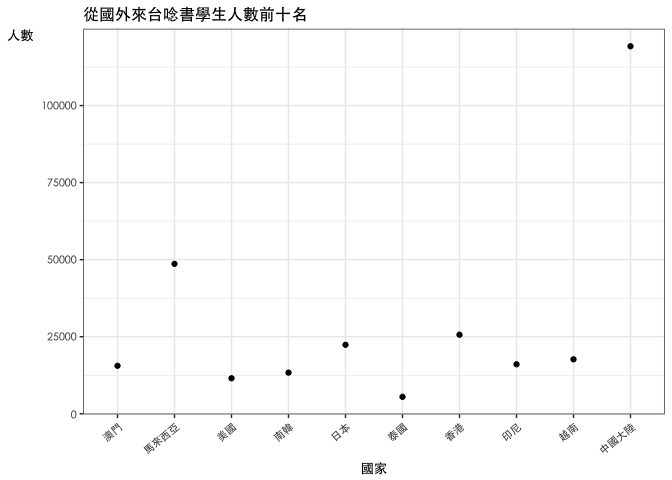
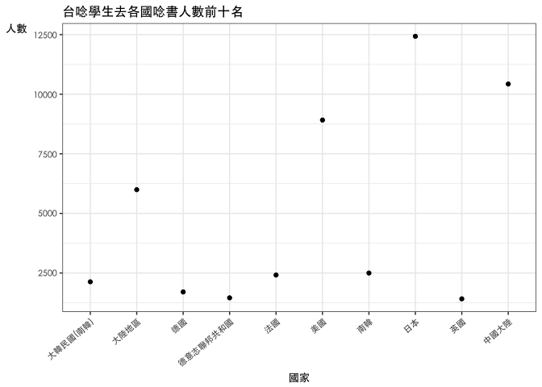

106-2 大數據分析方法 作業二
================
黃立玟

作業完整說明[連結](https://docs.google.com/document/d/1aLGSsGXhgOVgwzSg9JdaNz2qGPQJSoupDAQownkGf_I/edit?usp=sharing)

學習再也不限定在自己出生的國家，台灣每年有許多學生選擇就讀國外的大專院校，同時也有人多國外的學生來台灣就讀，透過分析[大專校院境外學生人數統計](https://data.gov.tw/dataset/6289)、[大專校院本國學生出國進修交流數](https://data.gov.tw/dataset/24730)、[世界各主要國家之我國留學生人數統計表](https://ws.moe.edu.tw/Download.ashx?u=C099358C81D4876CC7586B178A6BD6D5062C39FB76BDE7EC7685C1A3C0846BCDD2B4F4C2FE907C3E7E96F97D24487065577A728C59D4D9A4ECDFF432EA5A114C8B01E4AFECC637696DE4DAECA03BB417&n=4E402A02CE6F0B6C1B3C7E89FDA1FAD0B5DDFA6F3DA74E2DA06AE927F09433CFBC07A1910C169A1845D8EB78BD7D60D7414F74617F2A6B71DC86D17C9DA3781394EF5794EEA7363C&icon=..csv)可以了解103年以後各大專院校國際交流的情形。請同學分析以下議題，並以視覺化的方式呈現分析結果，呈現103年以後大專院校國際交流的情形。

來台境外生分析
--------------

### 資料匯入與處理

``` r
#這是R Code Chunk

##依照國家分類
library(readr)
X104 <- read_csv("~/Downloads/104.csv")
```

    ## Parsed with column specification:
    ## cols(
    ##   洲別 = col_character(),
    ##   國別 = col_character(),
    ##   `學位生-正式修讀學位外國生` = col_integer(),
    ##   `學位生-僑生(含港澳)` = col_integer(),
    ##   `學位生-正式修讀學位陸生` = col_integer(),
    ##   `非學位生-外國交換生` = col_integer(),
    ##   `非學位生-外國短期研習及個人選讀` = col_integer(),
    ##   `非學位生-大專附設華語文中心學生` = col_integer(),
    ##   `非學位生-大陸研修生` = col_integer(),
    ##   `非學位生-海青班` = col_integer(),
    ##   境外專班 = col_integer()
    ## )

``` r
X104$各國人數加總104<-rowSums(X104[,3:11])
X104new<-X104[,c(T,T,F,F,F,F,F,F,F,F,F,T)]

#---------------------------------------------
library(readr)
X105 <- read_csv("~/Downloads/105.csv")
```

    ## Parsed with column specification:
    ## cols(
    ##   洲別 = col_character(),
    ##   國別 = col_character(),
    ##   學位生_正式修讀學位外國生 = col_integer(),
    ##   `學位生_僑生(含港澳)` = col_integer(),
    ##   學位生_正式修讀學位陸生 = col_integer(),
    ##   非學位生_外國交換生 = col_integer(),
    ##   非學位生_外國短期研習及個人選讀 = col_integer(),
    ##   非學位生_大專附設華語文中心學生 = col_integer(),
    ##   非學位生_大陸研修生 = col_integer(),
    ##   非學位生_海青班 = col_integer(),
    ##   境外專班 = col_integer()
    ## )

``` r
X105$各國人數加總105<-rowSums(X105[,3:11])
X105new<-X105[,c(T,T,F,F,F,F,F,F,F,F,F,T)]

#---------------------------------------------
library(readr)
X106<- read_csv("~/Downloads/106.csv")
```

    ## Parsed with column specification:
    ## cols(
    ##   洲別 = col_character(),
    ##   國別 = col_character(),
    ##   學位生_正式修讀學位外國生 = col_integer(),
    ##   `學位生_僑生(含港澳)` = col_integer(),
    ##   學位生_正式修讀學位陸生 = col_integer(),
    ##   非學位生_外國交換生 = col_integer(),
    ##   非學位生_外國短期研習及個人選讀 = col_integer(),
    ##   非學位生_大專附設華語文中心學生 = col_integer(),
    ##   非學位生_大陸研修生 = col_integer(),
    ##   非學位生_海青班 = col_integer(),
    ##   境外專班 = col_integer()
    ## )

``` r
X106$各國人數加總106<-rowSums(X106[,3:11])
X106new<-X106[,c(T,T,F,F,F,F,F,F,F,F,F,T)]


#依照校別分類
library(readr)
X104school <- read_csv("~/Downloads/104school.csv")
```

    ## Parsed with column specification:
    ## cols(
    ##   學校類型 = col_character(),
    ##   學校代碼 = col_character(),
    ##   學校名稱 = col_character(),
    ##   `學位生-正式修讀學位外國生` = col_integer(),
    ##   `學位生-僑生(含港澳)` = col_integer(),
    ##   `學位生-正式修讀學位陸生` = col_integer(),
    ##   `非學位生-外國交換生` = col_integer(),
    ##   `非學位生-外國短期研習及個人選讀` = col_integer(),
    ##   `非學位生-大專附設華語文中心學生` = col_integer(),
    ##   `非學位生-大陸研修生` = col_character(),
    ##   `非學位生-海青班` = col_integer(),
    ##   境外專班 = col_integer()
    ## )

``` r
X104school$`非學位生-大陸研修生`<-gsub("…","0",X104school$`非學位生-大陸研修生`)
X104school$`非學位生-大陸研修生`<-as.numeric(X104school$`非學位生-大陸研修生`)
X104school$境外學生人數加總104<-rowSums(X104school[,4:12])
X104schoolnew<-X104school[,c(T,T,T,F,F,F,F,F,F,F,F,F,T)]

#----------------------------------------------------------------------------------

library(readr)
X105school <- read_csv("~/Downloads/105school.csv")
```

    ## Parsed with column specification:
    ## cols(
    ##   學校類型 = col_character(),
    ##   學校代碼 = col_character(),
    ##   學校名稱 = col_character(),
    ##   學位生_正式修讀學位外國生 = col_integer(),
    ##   `學位生_僑生(含港澳)` = col_integer(),
    ##   學位生_正式修讀學位陸生 = col_integer(),
    ##   非學位生_外國交換生 = col_integer(),
    ##   非學位生_外國短期研習及個人選讀 = col_integer(),
    ##   非學位生_大專附設華語文中心學生 = col_integer(),
    ##   非學位生_大陸研修生 = col_integer(),
    ##   非學位生_海青班 = col_integer(),
    ##   境外專班 = col_integer()
    ## )

``` r
X105school$境外學生人數加總105<-rowSums(X105school[,4:12])
X105schoolnew<-X105school[,c(T,T,T,F,F,F,F,F,F,F,F,F,T)]

#----------------------------------------------------------------------------------

library(readr)
X106school <- read_csv("~/Downloads/106school.csv")
```

    ## Parsed with column specification:
    ## cols(
    ##   學校類型 = col_character(),
    ##   學校代碼 = col_character(),
    ##   學校名稱 = col_character(),
    ##   學位生_正式修讀學位外國生 = col_integer(),
    ##   `學位生_僑生(含港澳)` = col_integer(),
    ##   學位生_正式修讀學位陸生 = col_integer(),
    ##   非學位生_外國交換生 = col_integer(),
    ##   非學位生_外國短期研習及個人選讀 = col_integer(),
    ##   非學位生_大專附設華語文中心學生 = col_integer(),
    ##   非學位生_大陸研修生 = col_integer(),
    ##   非學位生_海青班 = col_integer(),
    ##   境外專班 = col_integer()
    ## )

``` r
X106school$境外學生人數加總106<-rowSums(X106school[,4:12])
X106schoolnew<-X106school[,c(T,T,T,F,F,F,F,F,F,F,F,F,T)]
```

### 哪些國家來台灣唸書的學生最多呢？

``` r
#這是R Code Chunk

library(dplyr)
```

    ## 
    ## Attaching package: 'dplyr'

    ## The following objects are masked from 'package:stats':
    ## 
    ##     filter, lag

    ## The following objects are masked from 'package:base':
    ## 
    ##     intersect, setdiff, setequal, union

``` r
J0405<-full_join(X104new,X105new,by=c("洲別","國別"))

library(dplyr)
J040506<-full_join(J0405,X106new,by=c("洲別","國別"))

J040506$各國人數加總104<-as.numeric(J040506$各國人數加總104)
J040506$各國人數加總105<-as.numeric(J040506$各國人數加總105)
J040506$各國人數加總106<-as.numeric(J040506$各國人數加總106)

J040506$三年度加總<-rowSums(J040506[,3:5],na.rm=TRUE)

J040506<-J040506[order(J040506$三年度加總,decreasing = T),]
J040506fin<-J040506[1:10,]
knitr::kable(J040506fin)
```

| 洲別 | 國別     | 各國人數加總104 | 各國人數加總105 | 各國人數加總106 | 三年度加總 |
|:-----|:---------|:---------------:|:---------------:|:---------------:|:----------:|
| 亞洲 | 中國大陸 |      41951      |      41981      |      35304      |   119236   |
| 亞洲 | 馬來西亞 |      15054      |      16311      |      17281      |    48646   |
| 亞洲 | 香港     |       8233      |       8660      |       8761      |    25654   |
| 亞洲 | 日本     |       6455      |       7542      |       8387      |    22384   |
| 亞洲 | 越南     |       4459      |       5342      |       7864      |    17665   |
| 亞洲 | 印尼     |       4454      |       5154      |       6453      |    16061   |
| 亞洲 | 澳門     |       5152      |       5286      |       5141      |    15579   |
| 亞洲 | 南韓     |       4062      |       4575      |       4724      |    13361   |
| 美洲 | 美國     |       4003      |       3701      |       3814      |    11518   |
| 亞洲 | 泰國     |       1591      |       1771      |       2138      |    5500    |

### 哪間大學的境外生最多呢？

``` r
#這是R Code Chunk

library(dplyr)
JS0405<-full_join(X104schoolnew,X105schoolnew,by=c("學校類型","學校代碼","學校名稱"))

library(dplyr)
JS040506<-full_join(JS0405,X106schoolnew,by=c("學校類型","學校代碼","學校名稱"))

JS040506$三年度加總<-rowSums(JS040506[,4:6],na.rm=TRUE)

JS040506<-JS040506[order(JS040506$三年度加總,decreasing = T),]
JS040506fin<-JS040506[2:11,]
knitr::kable(JS040506fin)
```

| 學校類型 | 學校代碼 | 學校名稱         | 境外學生人數加總104 | 境外學生人數加總105 | 境外學生人數加總106 | 三年度加總 |
|:---------|:---------|:-----------------|:-------------------:|:-------------------:|:-------------------:|:----------:|
| 大專校院 | 0004     | 國立臺灣師範大學 |         5328        |         5709        |         6428        |    17465   |
| 大專校院 | 0003     | 國立臺灣大學     |         4514        |         4817        |         5068        |    14399   |
| 大專校院 | 1016     | 銘傳大學         |         4152        |         4159        |         4294        |    12605   |
| 大專校院 | 1006     | 中國文化大學     |         4188        |         4046        |         3703        |    11937   |
| 大專校院 | 1005     | 淡江大學         |         3254        |         3727        |         3920        |    10901   |
| 大專校院 | 0001     | 國立政治大學     |         2871        |         2989        |         3061        |    8921    |
| 大專校院 | 0005     | 國立成功大學     |         2554        |         2864        |         3179        |    8597    |
| 大專校院 | 1007     | 逢甲大學         |         2479        |         2440        |         2523        |    7442    |
| 大專校院 | 1002     | 輔仁大學         |         2271        |         2518        |         2434        |    7223    |
| 大專校院 | 1004     | 中原大學         |         1703        |         1995        |         2611        |    6309    |

### 各個國家來台灣唸書的學生人數條狀圖

``` r
#這是R Code Chunk
library(ggplot2)
ggplot(data = J040506)+
  geom_bar(aes(x=J040506$國別,y=J040506$三年度加總),
           stat = "identity")+
  labs(title="各國學生來台灣唸書總人數 ",
       x="國家",
       y="人數") +
  theme_bw()+theme(text = element_text(family = "黑體-繁 中黑",size=10),
                   axis.title.y = element_text(angle = 0),
                   axis.text.x = element_text(angle = 60, hjust = 1))
```


### 各個國家來台灣唸書的學生人數面量圖

``` r
#這是R Code Chunk
library(jsonlite)
library(RCurl)
```

    ## Loading required package: bitops

``` r
library(httr)
Countryname<-fromJSON("https://gist.githubusercontent.com/jacobbubu/060d84c2bdf005d412db/raw/845c78f55e49fee89814bdc599355069f07b7ee6/countries.json")

Countrychang<-Countryname[,c(F,T,F,F,F,F,T,F,F)]
colnames(Countrychang)<-c("國家名稱縮寫", "國別")
library(dplyr)
J040506new<-left_join(J040506,Countrychang,by="國別")

J040506new$國家名稱縮寫[1]<-("CHN")
J040506new$國家名稱縮寫[8]<-("KOR")
J040506new$國家名稱縮寫[12]<-("SGP")
J040506new$國家名稱縮寫[30]<-("SAU")
J040506new$國家名稱縮寫[45]<-("AUS")
J040506new$國家名稱縮寫[47]<-("SLB")
J040506new$國家名稱縮寫[49]<-("MHL")
J040506new$國家名稱縮寫[50]<-("TUV")
J040506new$國家名稱縮寫[53]<-("PNG")
J040506new$國家名稱縮寫[55]<-("FSM")
J040506new$國家名稱縮寫[80]<-("SLE")
J040506new$國家名稱縮寫[83]<-("NAM")
J040506new$國家名稱縮寫[92]<-("SOM")
J040506new$國家名稱縮寫[115]<-("HRV")
J040506new$國家名稱縮寫[123]<-("SRB")
J040506new$國家名稱縮寫[124]<-("BIH")
J040506new$國家名稱縮寫[126]<-("MLT")
J040506new$國家名稱縮寫[129]<-("")
J040506new$國家名稱縮寫[132]<-("HND")
J040506new$國家名稱縮寫[144]<-("VCT")
J040506new$國家名稱縮寫[149]<-("KNA")
J040506new$國家名稱縮寫[156]<-("TTO")
J040506new$國家名稱縮寫[160]<-("COD")
J040506new$國家名稱縮寫[161]<-("")
J040506new$國家名稱縮寫[169]<-("CYP")
J040506new$國家名稱縮寫[172]<-("SSD")

##互動式面量圖
library(ggplot2)
library(plotly)
```

    ## 
    ## Attaching package: 'plotly'

    ## The following object is masked from 'package:httr':
    ## 
    ##     config

    ## The following object is masked from 'package:ggplot2':
    ## 
    ##     last_plot

    ## The following object is masked from 'package:stats':
    ## 
    ##     filter

    ## The following object is masked from 'package:graphics':
    ## 
    ##     layout

``` r
l <- list(color = toRGB("grey"), width = 0.8)
g <- list(
  showframe=FALSE,
  showcountries=TRUE,
  showcoastlines=TRUE,
  coastlinecolor=toRGB("grey"),
  countrycolor=toRGB("grey")) 

p<-plot_ly(J040506, z=~`三年度加總`, text=~`國別`, locations=~`國別`, type= 'choropleth', 
        color=~`三年度加總`, colors='Purples', marker = list(line = l)) %>%
  layout(title='Numbers of All exchange students', geo=g)


p
```

    ## Warning: package 'bindrcpp' was built under R version 3.4.4

<!--html_preserve-->

<script type="application/json" data-for="65e06f4a4487">{"x":{"visdat":{"65e0432bc7cc":["function () ","plotlyVisDat"]},"cur_data":"65e0432bc7cc","attrs":{"65e0432bc7cc":{"z":{},"text":{},"locations":{},"marker":{"line":{"color":"rgba(190,190,190,1)","width":0.8}},"color":{},"colors":"Purples","alpha":1,"sizes":[10,100],"type":"choropleth"}},"layout":{"margin":{"b":40,"l":60,"t":25,"r":10},"title":"Numbers of All exchange students","geo":{"showframe":false,"showcountries":true,"showcoastlines":true,"coastlinecolor":"rgba(190,190,190,1)","countrycolor":"rgba(190,190,190,1)"},"scene":{"zaxis":{"title":"三年度加總"}},"xaxis":{"domain":[0,1]},"yaxis":{"domain":[0,1]},"hovermode":"closest","showlegend":false,"legend":{"y":0.5,"yanchor":"top"}},"source":"A","config":{"modeBarButtonsToAdd":[{"name":"Collaborate","icon":{"width":1000,"ascent":500,"descent":-50,"path":"M487 375c7-10 9-23 5-36l-79-259c-3-12-11-23-22-31-11-8-22-12-35-12l-263 0c-15 0-29 5-43 15-13 10-23 23-28 37-5 13-5 25-1 37 0 0 0 3 1 7 1 5 1 8 1 11 0 2 0 4-1 6 0 3-1 5-1 6 1 2 2 4 3 6 1 2 2 4 4 6 2 3 4 5 5 7 5 7 9 16 13 26 4 10 7 19 9 26 0 2 0 5 0 9-1 4-1 6 0 8 0 2 2 5 4 8 3 3 5 5 5 7 4 6 8 15 12 26 4 11 7 19 7 26 1 1 0 4 0 9-1 4-1 7 0 8 1 2 3 5 6 8 4 4 6 6 6 7 4 5 8 13 13 24 4 11 7 20 7 28 1 1 0 4 0 7-1 3-1 6-1 7 0 2 1 4 3 6 1 1 3 4 5 6 2 3 3 5 5 6 1 2 3 5 4 9 2 3 3 7 5 10 1 3 2 6 4 10 2 4 4 7 6 9 2 3 4 5 7 7 3 2 7 3 11 3 3 0 8 0 13-1l0-1c7 2 12 2 14 2l218 0c14 0 25-5 32-16 8-10 10-23 6-37l-79-259c-7-22-13-37-20-43-7-7-19-10-37-10l-248 0c-5 0-9-2-11-5-2-3-2-7 0-12 4-13 18-20 41-20l264 0c5 0 10 2 16 5 5 3 8 6 10 11l85 282c2 5 2 10 2 17 7-3 13-7 17-13z m-304 0c-1-3-1-5 0-7 1-1 3-2 6-2l174 0c2 0 4 1 7 2 2 2 4 4 5 7l6 18c0 3 0 5-1 7-1 1-3 2-6 2l-173 0c-3 0-5-1-8-2-2-2-4-4-4-7z m-24-73c-1-3-1-5 0-7 2-2 3-2 6-2l174 0c2 0 5 0 7 2 3 2 4 4 5 7l6 18c1 2 0 5-1 6-1 2-3 3-5 3l-174 0c-3 0-5-1-7-3-3-1-4-4-5-6z"},"click":"function(gd) { \n        // is this being viewed in RStudio?\n        if (location.search == '?viewer_pane=1') {\n          alert('To learn about plotly for collaboration, visit:\\n https://cpsievert.github.io/plotly_book/plot-ly-for-collaboration.html');\n        } else {\n          window.open('https://cpsievert.github.io/plotly_book/plot-ly-for-collaboration.html', '_blank');\n        }\n      }"}],"cloud":false},"data":[{"colorbar":{"title":"三年度加總","ticklen":2,"len":0.5,"y":1,"lenmode":"fraction","yanchor":"top"},"colorscale":[["0","rgba(252,251,253,1)"],["8.38679917809368e-06","rgba(252,251,253,1)"],["2.02680980137264e-05","rgba(252,251,253,1)"],["3.04021470205896e-05","rgba(252,251,253,1)"],["4.19339958904684e-05","rgba(252,251,253,1)"],["5.03207950685621e-05","rgba(252,251,253,1)"],["6.91910932192729e-05","rgba(252,251,253,1)"],["9.22547909590305e-05","rgba(252,251,253,1)"],["0.00011461958876728","rgba(252,251,253,1)"],["0.00015934918438378","rgba(252,251,253,1)"],["0.000278861072671615","rgba(252,251,253,1)"],["0.000370416963699137","rgba(252,251,253,1)"],["0.00047804755315134","rgba(252,251,253,1)"],["0.000776128373939419","rgba(252,251,253,1)"],["0.00118603318376875","rgba(252,251,253,1)"],["0.00149704365328972","rgba(252,251,253,1)"],["0.00171649823178317","rgba(252,251,253,1)"],["0.00243147286171566","rgba(252,251,253,1)"],["0.00344068436281293","rgba(252,251,253,1)"],["0.00431815322682098","rgba(252,251,253,1)"],["0.00577151563439147","rgba(251,250,253,1)"],["0.00931668553696482","rgba(251,250,252,1)"],["0.0184355823933129","rgba(250,249,252,1)"],["0.108827455584909","rgba(241,239,246,1)"],["1","rgba(63,0,125,1)"]],"showscale":true,"z":[119236,48646,25654,22384,17665,16061,15579,13361,11518,5500,5001,3988,3435,3038,2240,2142,2074,2034,1387,1357,1200,1150,1089,941,923,872,806,721,710,685,673,602,597,555,542,530,517,490,483,483,480,461,425,413,406,386,346,338,329,306,301,279,235,235,227,222,221,207,205,201,197,194,191,189,183,179,163,162,147,146,144,143,143,136,133,124,123,110,99,95,90,90,79,66,65,59,58,58,57,57,53,50,49,48,44,40,39,39,39,38,37,34,34,34,26,25,23,21,20,20,20,20,18,17,15,15,14,14,13,13,12,12,12,12,11,11,11,10,10,10,9,8,8,8,7,7,7,7,6,6,6,6,6,6,6,6,6,5,5,5,5,5,4,4,4,4,4,4,4,3,3,3,3,3,3,2,2,2,1,1,1,1,1,1],"text":["中國大陸","馬來西亞","香港","日本","越南","印尼","澳門","南韓","美國","泰國","法國","印度","德國","蒙古","新加坡","菲律賓","加拿大","緬甸","澳大利亞","英國","俄羅斯","荷蘭","西班牙","史瓦濟蘭","義大利","宏都拉斯","捷克","巴西","波蘭","瑞典","墨西哥","奧地利","貝里斯","巴拉圭","巴拿馬","土耳其","薩爾瓦多","比利時","南非","甘比亞","尼加拉瓜","布吉納法索","海地","瓜地馬拉","瑞士","紐西蘭","聖露西亞","索羅門群島","衣索比亞","芬蘭","聖文森","多明尼加","匈牙利","厄瓜多","吉里巴斯","烏克蘭","聖克里斯多福","丹麥","阿根廷","秘魯","伊朗","哥倫比亞","約旦","斯洛伐克","尼泊爾","巴基斯坦","葡萄牙","以色列","帛琉","馬紹爾群島共和國","愛爾蘭","聖多美普林西比","羅馬尼亞","挪威","吐瓦魯","斯里蘭卡","馬拉威","智利","汶萊","埃及","奈及利亞","立陶宛","諾魯","肯亞","哥斯大黎加","斯洛維尼亞","孟加拉","巴布亞紐幾內亞","寮國","委內瑞拉","白俄羅斯","摩洛哥","伊拉克","克羅埃西亞","哈薩克","玻利維亞","吉爾吉斯","柬埔寨","希臘","不丹","烏茲別克","保加利亞","拉脫維亞","愛沙尼亞","辛巴威","坦尚尼亞","葉門","盧森堡","塔吉克","突尼西亞","烏干達","塞爾維亞共和國","剛果","巴勒斯坦","喀麥隆","象牙海岸","模里西斯","烏拉圭","斐濟","尚比亞","阿拉伯聯合大公國","亞美尼亞","莫三比克","查德","沙烏地阿拉伯","土庫曼","蒲隆地","波札那","阿爾及利亞","波士尼亞與赫塞哥維納","貝南","敘利亞","蘇丹","冰島","黎巴嫩","馬其頓","千里達","牙買加","巴林","多哥","加彭","盧安達","塞內加爾","科索沃共和國","剛果民主共和國","索馬利蘭共和國","巴哈馬","獅子山共和國","納米比亞","馬爾他","摩納哥","巴貝多","科威特","亞塞拜然","賴比瑞亞","馬達加斯加","多米尼克","阿爾巴尼亞","蓋亞那","摩爾多瓦","迦納","利比亞","古巴","賽普勒斯","南蘇丹共和國","索馬利亞民主共和國","幾內亞","蘇利南","密克羅尼西亞","茅利塔尼亞","尼日","北韓","幾內亞比索","馬利"],"locations":["中國大陸","馬來西亞","香港","日本","越南","印尼","澳門","南韓","美國","泰國","法國","印度","德國","蒙古","新加坡","菲律賓","加拿大","緬甸","澳大利亞","英國","俄羅斯","荷蘭","西班牙","史瓦濟蘭","義大利","宏都拉斯","捷克","巴西","波蘭","瑞典","墨西哥","奧地利","貝里斯","巴拉圭","巴拿馬","土耳其","薩爾瓦多","比利時","南非","甘比亞","尼加拉瓜","布吉納法索","海地","瓜地馬拉","瑞士","紐西蘭","聖露西亞","索羅門群島","衣索比亞","芬蘭","聖文森","多明尼加","匈牙利","厄瓜多","吉里巴斯","烏克蘭","聖克里斯多福","丹麥","阿根廷","秘魯","伊朗","哥倫比亞","約旦","斯洛伐克","尼泊爾","巴基斯坦","葡萄牙","以色列","帛琉","馬紹爾群島共和國","愛爾蘭","聖多美普林西比","羅馬尼亞","挪威","吐瓦魯","斯里蘭卡","馬拉威","智利","汶萊","埃及","奈及利亞","立陶宛","諾魯","肯亞","哥斯大黎加","斯洛維尼亞","孟加拉","巴布亞紐幾內亞","寮國","委內瑞拉","白俄羅斯","摩洛哥","伊拉克","克羅埃西亞","哈薩克","玻利維亞","吉爾吉斯","柬埔寨","希臘","不丹","烏茲別克","保加利亞","拉脫維亞","愛沙尼亞","辛巴威","坦尚尼亞","葉門","盧森堡","塔吉克","突尼西亞","烏干達","塞爾維亞共和國","剛果","巴勒斯坦","喀麥隆","象牙海岸","模里西斯","烏拉圭","斐濟","尚比亞","阿拉伯聯合大公國","亞美尼亞","莫三比克","查德","沙烏地阿拉伯","土庫曼","蒲隆地","波札那","阿爾及利亞","波士尼亞與赫塞哥維納","貝南","敘利亞","蘇丹","冰島","黎巴嫩","馬其頓","千里達","牙買加","巴林","多哥","加彭","盧安達","塞內加爾","科索沃共和國","剛果民主共和國","索馬利蘭共和國","巴哈馬","獅子山共和國","納米比亞","馬爾他","摩納哥","巴貝多","科威特","亞塞拜然","賴比瑞亞","馬達加斯加","多米尼克","阿爾巴尼亞","蓋亞那","摩爾多瓦","迦納","利比亞","古巴","賽普勒斯","南蘇丹共和國","索馬利亞民主共和國","幾內亞","蘇利南","密克羅尼西亞","茅利塔尼亞","尼日","北韓","幾內亞比索","馬利"],"marker":{"line":{"color":"rgba(190,190,190,1)","width":0.8}},"type":"choropleth","frame":null}],"highlight":{"on":"plotly_click","persistent":false,"dynamic":false,"selectize":false,"opacityDim":0.2,"selected":{"opacity":1}},"base_url":"https://plot.ly"},"evals":["config.modeBarButtonsToAdd.0.click"],"jsHooks":{"render":[{"code":"function(el, x) { var ctConfig = crosstalk.var('plotlyCrosstalkOpts').set({\"on\":\"plotly_click\",\"persistent\":false,\"dynamic\":false,\"selectize\":false,\"opacityDim\":0.2,\"selected\":{\"opacity\":1}}); }","data":null}]}}</script>
<!--/html_preserve-->


台灣學生國際交流分析
--------------------

### 資料匯入與處理

``` r
#這是R Code Chunk
library(readxl)
Student<- read_excel("~/Desktop/複製 - Student_RPT_07.xlsx")
```

### 台灣大專院校的學生最喜歡去哪些國家進修交流呢？

``` r
#這是R Code Chunk
library(dplyr)
Studentout<-group_by(Student,`對方學校(機構)國別(地區)`)%>%
  summarise(各國總人數=sum(小計))
Studentout1<-head(Studentout[order(Studentout$各國總人數,decreasing = T),],10)
knitr::kable(Studentout1)
```

| 對方學校(機構)國別(地區) | 各國總人數 |
|:-------------------------|:----------:|
| 日本                     |    12430   |
| 中國大陸                 |    10429   |
| 美國                     |    8916    |
| 大陸地區                 |    5996    |
| 南韓                     |    2498    |
| 法國                     |    2415    |
| 大韓民國(南韓)           |    2131    |
| 德國                     |    1706    |
| 德意志聯邦共和國         |    1458    |
| 英國                     |    1416    |

### 哪間大學的出國交流學生數最多呢？

``` r
#這是R Code Chunk
library(dplyr)
Studentschool<-group_by(Student,學校名稱)%>%
  summarise(各學校出國總人數=sum(小計))
Studentschool1<-head(Studentschool[order(Studentschool$各學校出國總人數,decreasing = T),],10)
knitr::kable(Studentschool1)
```

| 學校名稱     | 各學校出國總人數 |
|:-------------|:----------------:|
| 國立臺灣大學 |       4719       |
| 淡江大學     |       3794       |
| 國立政治大學 |       3479       |
| 逢甲大學     |       2646       |
| 東海大學     |       1881       |
| 元智大學     |       1864       |
| 國立交通大學 |       1513       |
| 東吳大學     |       1457       |
| 國立成功大學 |       1397       |
| 國立臺北大學 |       1397       |

### 台灣大專院校的學生最喜歡去哪些國家進修交流條狀圖

``` r
#這是R Code Chunk
library(ggplot2)
ggplot(data = Studentout)+
  geom_bar(aes(x=Studentout$`對方學校(機構)國別(地區)`,y=Studentout$各國總人數),
           stat = "identity")+
  labs(title="台灣學生到各國唸書人數",
       x="國家",
       y="人數") +
  theme_bw()+theme(text = element_text(family = "黑體-繁 中黑",size=10),
                  axis.title.y = element_text(angle = 0),
                  axis.text.x = element_text(angle = 60, hjust = 1))
```


### 台灣大專院校的學生最喜歡去哪些國家進修交流面量圖

``` r
#這是R Code Chunk
library(jsonlite)
library(RCurl)
library(httr)
Countryname<-fromJSON("https://gist.githubusercontent.com/jacobbubu/060d84c2bdf005d412db/raw/845c78f55e49fee89814bdc599355069f07b7ee6/countries.json")

Countrychang<-Countryname[,c(F,T,F,F,F,F,T,F,F)]
colnames(Countrychang)<-c("國家名稱縮寫", "國別")
colnames(Studentout)<-c("國別","各國總人數")
library(dplyr)
Studentoutnew<-left_join(Studentout,Countrychang,by="國別")

Studentoutnew$國家名稱縮寫[1]<-("AFG")
Studentoutnew$國家名稱縮寫[3]<-("OMN")
Studentoutnew$國家名稱縮寫[5]<-("EGY")
Studentoutnew$國家名稱縮寫[7]<-("IRL")
Studentoutnew$國家名稱縮寫[9]<-("EST")
Studentoutnew$國家名稱縮寫[11]<-("AUT")
Studentoutnew$國家名稱縮寫[12]<-("AUS")
Studentoutnew$國家名稱縮寫[15]<-("PAN")
Studentoutnew$國家名稱縮寫[17]<-("BRA")
Studentoutnew$國家名稱縮寫[18]<-("BLR")
Studentoutnew$國家名稱縮寫[19]<-("KIR")
Studentoutnew$國家名稱縮寫[23]<-("BEL")
Studentoutnew$國家名稱縮寫[25]<-("ISL")
Studentoutnew$國家名稱縮寫[27]<-("POL")
Studentoutnew$國家名稱縮寫[28]<-("PLW")
Studentoutnew$國家名稱縮寫[29]<-("KOR")
Studentoutnew$國家名稱縮寫[30]<-("CHN")
Studentoutnew$國家名稱縮寫[32]<-("DNK")
Studentoutnew$國家名稱縮寫[34]<-("DEU")
Studentoutnew$國家名稱縮寫[36]<-("RUS")
Studentoutnew$國家名稱縮寫[38]<-("ECU")
Studentoutnew$國家名稱縮寫[41]<-("PHL")
Studentoutnew$國家名稱縮寫[42]<-("FJI")
Studentoutnew$國家名稱縮寫[43]<-("FJI")
Studentoutnew$國家名稱縮寫[45]<-("FIN")
Studentoutnew$國家名稱縮寫[46]<-("GMB")
Studentoutnew$國家名稱縮寫[49]<-("CRI")
Studentoutnew$國家名稱縮寫[52]<-("NLD")
Studentoutnew$國家名稱縮寫[55]<-("KHM")
Studentoutnew$國家名稱縮寫[57]<-("CZE")
Studentoutnew$國家名稱縮寫[59]<-("")
Studentoutnew$國家名稱縮寫[61]<-("HRV")
Studentoutnew$國家名稱縮寫[62]<-("HRV")
Studentoutnew$國家名稱縮寫[64]<-("LVA")
Studentoutnew$國家名稱縮寫[66]<-("LTU")
Studentoutnew$國家名稱縮寫[68]<-("LIE")
Studentoutnew$國家名稱縮寫[69]<-("LUX")
Studentoutnew$國家名稱縮寫[71]<-("MLT")
Studentoutnew$國家名稱縮寫[76]<-("MNG")
Studentoutnew$國家名稱縮寫[79]<-("MMR")
Studentoutnew$國家名稱縮寫[80]<-("MUS")
Studentoutnew$國家名稱縮寫[82]<-("MAR")
Studentoutnew$國家名稱縮寫[84]<-("MOZ")
Studentoutnew$國家名稱縮寫[86]<-("MEX")
Studentoutnew$國家名稱縮寫[88]<-("ZAF")
Studentoutnew$國家名稱縮寫[89]<-("KOR")
Studentoutnew$國家名稱縮寫[94]<-("NOR")
Studentoutnew$國家名稱縮寫[96]<-("PRT")
Studentoutnew$國家名稱縮寫[99]<-("SWE")
Studentoutnew$國家名稱縮寫[101]<-("SRB")
Studentoutnew$國家名稱縮寫[102]<-("SYC")
Studentoutnew$國家名稱縮寫[104]<-("SAU")
Studentoutnew$國家名稱縮寫[106]<-("STP")
Studentoutnew$國家名稱縮寫[108]<-("SWZ")
Studentoutnew$國家名稱縮寫[110]<-("LKA")
Studentoutnew$國家名稱縮寫[112]<-("SVK")
Studentoutnew$國家名稱縮寫[114]<-("SVN")
Studentoutnew$國家名稱縮寫[115]<-("SLB")
Studentoutnew$國家名稱縮寫[117]<-("THA")
Studentoutnew$國家名稱縮寫[119]<-("TUN")
Studentoutnew$國家名稱縮寫[121]<-("TUR")
Studentoutnew$國家名稱縮寫[123]<-("BRN")
Studentoutnew$國家名稱縮寫[125]<-("ESP")
Studentoutnew$國家名稱縮寫[127]<-("GRC")
Studentoutnew$國家名稱縮寫[129]<-("SGP")
Studentoutnew$國家名稱縮寫[130]<-("SGP")
Studentoutnew$國家名稱縮寫[132]<-("HUN")
Studentoutnew$國家名稱縮寫[134]<-("IRN")
Studentoutnew$國家名稱縮寫[137]<-("ITA")
Studentoutnew$國家名稱縮寫[139]<-("IND")
Studentoutnew$國家名稱縮寫[140]<-("IDN")
Studentoutnew$國家名稱縮寫[144]<-("JOR")
Studentoutnew$國家名稱縮寫[146]<-("VNM")
Studentoutnew$國家名稱縮寫[148]<-("CHN")


library(ggplot2)
library(plotly)
a<- list(color = toRGB("grey"), width = 0.8)
b<- list(
  showframe=FALSE,
  showcountries=TRUE,
  showcoastlines=TRUE,
  coastlinecolor=toRGB("grey"),
  countrycolor=toRGB("grey"))


##互動式面量圖

q<-plot_ly(Studentoutnew, z=~`各國總人數`, text=~`國家名稱縮寫`, locations=~`國家名稱縮寫`, type= 'choropleth', 
        color=~`各國總人數`, colors='Blues', marker = list(line = a)) %>%
  layout(title='Number of Taiwanese students studying in other countries ', geo=b)
q
```

<!--html_preserve-->

<script type="application/json" data-for="65e031ea5f36">{"x":{"visdat":{"65e074c30e75":["function () ","plotlyVisDat"]},"cur_data":"65e074c30e75","attrs":{"65e074c30e75":{"z":{},"text":{},"locations":{},"marker":{"line":{"color":"rgba(190,190,190,1)","width":0.8}},"color":{},"colors":"Blues","alpha":1,"sizes":[10,100],"type":"choropleth"}},"layout":{"margin":{"b":40,"l":60,"t":25,"r":10},"title":"Number of Taiwanese students studying in other countries ","geo":{"showframe":false,"showcountries":true,"showcoastlines":true,"coastlinecolor":"rgba(190,190,190,1)","countrycolor":"rgba(190,190,190,1)"},"scene":{"zaxis":{"title":"各國總人數"}},"xaxis":{"domain":[0,1]},"yaxis":{"domain":[0,1]},"hovermode":"closest","showlegend":false,"legend":{"y":0.5,"yanchor":"top"}},"source":"A","config":{"modeBarButtonsToAdd":[{"name":"Collaborate","icon":{"width":1000,"ascent":500,"descent":-50,"path":"M487 375c7-10 9-23 5-36l-79-259c-3-12-11-23-22-31-11-8-22-12-35-12l-263 0c-15 0-29 5-43 15-13 10-23 23-28 37-5 13-5 25-1 37 0 0 0 3 1 7 1 5 1 8 1 11 0 2 0 4-1 6 0 3-1 5-1 6 1 2 2 4 3 6 1 2 2 4 4 6 2 3 4 5 5 7 5 7 9 16 13 26 4 10 7 19 9 26 0 2 0 5 0 9-1 4-1 6 0 8 0 2 2 5 4 8 3 3 5 5 5 7 4 6 8 15 12 26 4 11 7 19 7 26 1 1 0 4 0 9-1 4-1 7 0 8 1 2 3 5 6 8 4 4 6 6 6 7 4 5 8 13 13 24 4 11 7 20 7 28 1 1 0 4 0 7-1 3-1 6-1 7 0 2 1 4 3 6 1 1 3 4 5 6 2 3 3 5 5 6 1 2 3 5 4 9 2 3 3 7 5 10 1 3 2 6 4 10 2 4 4 7 6 9 2 3 4 5 7 7 3 2 7 3 11 3 3 0 8 0 13-1l0-1c7 2 12 2 14 2l218 0c14 0 25-5 32-16 8-10 10-23 6-37l-79-259c-7-22-13-37-20-43-7-7-19-10-37-10l-248 0c-5 0-9-2-11-5-2-3-2-7 0-12 4-13 18-20 41-20l264 0c5 0 10 2 16 5 5 3 8 6 10 11l85 282c2 5 2 10 2 17 7-3 13-7 17-13z m-304 0c-1-3-1-5 0-7 1-1 3-2 6-2l174 0c2 0 4 1 7 2 2 2 4 4 5 7l6 18c0 3 0 5-1 7-1 1-3 2-6 2l-173 0c-3 0-5-1-8-2-2-2-4-4-4-7z m-24-73c-1-3-1-5 0-7 2-2 3-2 6-2l174 0c2 0 5 0 7 2 3 2 4 4 5 7l6 18c1 2 0 5-1 6-1 2-3 3-5 3l-174 0c-3 0-5-1-7-3-3-1-4-4-5-6z"},"click":"function(gd) { \n        // is this being viewed in RStudio?\n        if (location.search == '?viewer_pane=1') {\n          alert('To learn about plotly for collaboration, visit:\\n https://cpsievert.github.io/plotly_book/plot-ly-for-collaboration.html');\n        } else {\n          window.open('https://cpsievert.github.io/plotly_book/plot-ly-for-collaboration.html', '_blank');\n        }\n      }"}],"cloud":false},"data":[{"colorbar":{"title":"各國總人數","ticklen":2,"len":0.5,"y":1,"lenmode":"fraction","yanchor":"top"},"colorscale":[["0","rgba(247,251,255,1)"],["3.01713734009172e-05","rgba(247,251,255,1)"],["8.04569957357792e-05","rgba(247,251,255,1)"],["0.000160913991471558","rgba(247,251,255,1)"],["0.000241370987207338","rgba(247,251,255,1)"],["0.000321827982943117","rgba(247,251,255,1)"],["0.000482741974414675","rgba(247,251,255,1)"],["0.000724112961622013","rgba(247,251,255,1)"],["0.000804569957357792","rgba(247,251,255,1)"],["0.000885026953093572","rgba(247,251,255,1)"],["0.00128731193177247","rgba(247,251,255,1)"],["0.00187062515085687","rgba(247,251,255,1)"],["0.00265508085928071","rgba(246,251,255,1)"],["0.00321827982943117","rgba(246,251,255,1)"],["0.00587336068871188","rgba(246,250,255,1)"],["0.00823678493845039","rgba(245,250,254,1)"],["0.0109622656689999","rgba(245,250,254,1)"],["0.0182838522809558","rgba(243,249,254,1)"],["0.0273956070480328","rgba(242,247,253,1)"],["0.0383176442191649","rgba(239,246,253,1)"],["0.0799139110145627","rgba(231,241,250,1)"],["0.167099123018746","rgba(214,230,244,1)"],["1","rgba(8,48,107,1)"]],"showscale":true,"z":[3,1,6,21,25,38,34,2,14,278,262,926,73,21,11,10,7,2,1,16,7,161,132,13,2,153,94,3,2131,5996,74,54,1706,1458,348,226,6,5,2415,93,157,1,1,222,106,4,5,1,1,1,476,349,1180,35,25,377,321,2,1,58,10,4,7,10,23,41,1,1,3,11,3,4,1017,8916,2,10,2,4,12,1,5,3,10,2,26,17,8,6,2498,11,1,232,67,34,31,10,12430,352,209,335,4,1,8,1,1,3,6,4,1,3,11,26,19,5,17,424,567,9,13,121,82,1,12,774,478,12,4,1029,678,479,88,20,1,1,57,247,103,41,74,120,36,1416,12,10,122,112,37,10429],"text":["AFG","OMN","OMN","EGY","EGY","IRL","IRL","EST","EST","AUT","AUT","AUS","MAC","PAN","PAN","BRA","BRA","BLR","KIR","PRK","BLZ","BEL","BEL","ISL","ISL","POL","POL","PLW","KOR","CHN","DNK","DNK","DEU","DEU","RUS","RUS","ECU","ECU","FRA","PHL","PHL","FJI","FJI","FIN","FIN","GMB","COL","CRI","CRI","GRD","NLD","NLD","CAN","KHM","KHM","CZE","CZE","QAT","","KWT","HRV","HRV","LVA","LVA","LTU","LTU","LIE","LIE","LUX","ROU","MLT","MWI","MYS","USA","MNG","MNG","BGD","PER","MMR","MUS","MAR","MAR","MCO","MOZ","MEX","MEX","ZAF","ZAF","KOR","NPL","NER","NZL","NOR","NOR","PRT","PRT","JPN","SWE","SWE","CHE","SRB","SYC","SAU","SAU","STP","STP","SWZ","SWZ","LKA","LKA","SVK","SVK","SVN","SVN","SLB","THA","THA","TUN","TUN","TUR","TUR","BRN","BRN","ESP","ESP","GRC","GRC","HKG","SGP","SGP","HUN","HUN","JAM","IRN","ISR","ITA","ITA","IND","IND","IDN","IDN","GBR","JOR","JOR","VNM","VNM","CHL","CHN"],"locations":["AFG","OMN","OMN","EGY","EGY","IRL","IRL","EST","EST","AUT","AUT","AUS","MAC","PAN","PAN","BRA","BRA","BLR","KIR","PRK","BLZ","BEL","BEL","ISL","ISL","POL","POL","PLW","KOR","CHN","DNK","DNK","DEU","DEU","RUS","RUS","ECU","ECU","FRA","PHL","PHL","FJI","FJI","FIN","FIN","GMB","COL","CRI","CRI","GRD","NLD","NLD","CAN","KHM","KHM","CZE","CZE","QAT","","KWT","HRV","HRV","LVA","LVA","LTU","LTU","LIE","LIE","LUX","ROU","MLT","MWI","MYS","USA","MNG","MNG","BGD","PER","MMR","MUS","MAR","MAR","MCO","MOZ","MEX","MEX","ZAF","ZAF","KOR","NPL","NER","NZL","NOR","NOR","PRT","PRT","JPN","SWE","SWE","CHE","SRB","SYC","SAU","SAU","STP","STP","SWZ","SWZ","LKA","LKA","SVK","SVK","SVN","SVN","SLB","THA","THA","TUN","TUN","TUR","TUR","BRN","BRN","ESP","ESP","GRC","GRC","HKG","SGP","SGP","HUN","HUN","JAM","IRN","ISR","ITA","ITA","IND","IND","IDN","IDN","GBR","JOR","JOR","VNM","VNM","CHL","CHN"],"marker":{"line":{"color":"rgba(190,190,190,1)","width":0.8}},"type":"choropleth","frame":null}],"highlight":{"on":"plotly_click","persistent":false,"dynamic":false,"selectize":false,"opacityDim":0.2,"selected":{"opacity":1}},"base_url":"https://plot.ly"},"evals":["config.modeBarButtonsToAdd.0.click"],"jsHooks":{"render":[{"code":"function(el, x) { var ctConfig = crosstalk.var('plotlyCrosstalkOpts').set({\"on\":\"plotly_click\",\"persistent\":false,\"dynamic\":false,\"selectize\":false,\"opacityDim\":0.2,\"selected\":{\"opacity\":1}}); }","data":null}]}}</script>
<!--/html_preserve-->
 \#\# 台灣學生出國留學分析

### 資料匯入與處理

``` r
#這是R Code Chunk

library(readr)
Worldstudents<- read_csv("~/Downloads/世界各主要國家之我國留學生人數統計表.csv")
```

    ## Warning: Missing column names filled in: 'X4' [4], 'X5' [5], 'X6' [6]

    ## Parsed with column specification:
    ## cols(
    ##   洲別 = col_character(),
    ##   國別 = col_character(),
    ##   總人數 = col_number(),
    ##   X4 = col_character(),
    ##   X5 = col_character(),
    ##   X6 = col_character()
    ## )

### 台灣學生最喜歡去哪些國家留學呢？

``` r
#這是R Code Chunk

Worldstudents$總人數
```

    ##  [1]  3815  1488   561   419   181    33   120   400    37    20   113
    ## [12]     2  4827 21127 13582  1106  8444   265   217     9   502   210
    ## [23]    64    15   364    19    14     1     1

``` r
Worldstudentstop<-Worldstudents[order(Worldstudents$總人數,decreasing = T),]
Worldstudentstop10<-Worldstudentstop[1:10,]
knitr::kable(Worldstudentstop10)
```

| 洲別   | 國別     | 總人數 | X4  | X5  | X6  |
|:-------|:---------|:------:|:----|:----|:----|
| 美洲   | 美國     |  21127 | NA  | NA  | NA  |
| 大洋洲 | 澳大利亞 |  13582 | NA  | NA  | NA  |
| 亞洲   | 日本     |  8444  | NA  | NA  | NA  |
| 美洲   | 加拿大   |  4827  | NA  | NA  | NA  |
| 歐洲   | 英國     |  3815  | NA  | NA  | NA  |
| 歐洲   | 德國     |  1488  | NA  | NA  | NA  |
| 大洋洲 | 紐西蘭   |  1106  | NA  | NA  | NA  |
| 歐洲   | 波蘭     |   561  | NA  | NA  | NA  |
| 亞洲   | 馬來西亞 |   502  | NA  | NA  | NA  |
| 歐洲   | 奧地利   |   419  | NA  | NA  | NA  |

### 台灣學生最喜歡去哪些國家留學面量圖

``` r
#這是R Code Chunk

library(jsonlite)
library(RCurl)
library(httr)
Countryname<-fromJSON("https://gist.githubusercontent.com/jacobbubu/060d84c2bdf005d412db/raw/845c78f55e49fee89814bdc599355069f07b7ee6/countries.json")


Countrychang<-Countryname[,c(F,T,F,F,F,F,T,F,F)]
colnames(Countrychang)<-c("國家名稱縮寫", "國別")

library(dplyr)
Worldstudentstop<-left_join(Worldstudentstop,Countrychang,by="國別")

Worldstudentstop$國家名稱縮寫[2]<-("AUS")
Worldstudentstop$國家名稱縮寫[13]<-("KOR")
Worldstudentstop$國家名稱縮寫[26]<-("SGP")


library(ggplot2)
library(plotly)
c<- list(color = toRGB("grey"), width = 0.8)
d<- list(
  showframe=FALSE,
  showcountries=TRUE,
  showcoastlines=TRUE,
  coastlinecolor=toRGB("grey"),
  countrycolor=toRGB("grey"))


##互動式面量圖

r<-plot_ly(Worldstudentstop, z=~`總人數`, text=~`國家名稱縮寫`, locations=~`國家名稱縮寫`, type= 'choropleth', 
        color=~`總人數`, colors='Reds', marker = list(line = c)) %>%
  layout(title='Number of Taiwanese students study abroad', geo=d)

r
```

<!--html_preserve-->

<script type="application/json" data-for="65e0351426c0">{"x":{"visdat":{"65e040f770e2":["function () ","plotlyVisDat"]},"cur_data":"65e040f770e2","attrs":{"65e040f770e2":{"z":{},"text":{},"locations":{},"marker":{"line":{"color":"rgba(190,190,190,1)","width":0.8}},"color":{},"colors":"Reds","alpha":1,"sizes":[10,100],"type":"choropleth"}},"layout":{"margin":{"b":40,"l":60,"t":25,"r":10},"title":"Number of Taiwanese students study abroad","geo":{"showframe":false,"showcountries":true,"showcoastlines":true,"coastlinecolor":"rgba(190,190,190,1)","countrycolor":"rgba(190,190,190,1)"},"scene":{"zaxis":{"title":"總人數"}},"xaxis":{"domain":[0,1]},"yaxis":{"domain":[0,1]},"hovermode":"closest","showlegend":false,"legend":{"y":0.5,"yanchor":"top"}},"source":"A","config":{"modeBarButtonsToAdd":[{"name":"Collaborate","icon":{"width":1000,"ascent":500,"descent":-50,"path":"M487 375c7-10 9-23 5-36l-79-259c-3-12-11-23-22-31-11-8-22-12-35-12l-263 0c-15 0-29 5-43 15-13 10-23 23-28 37-5 13-5 25-1 37 0 0 0 3 1 7 1 5 1 8 1 11 0 2 0 4-1 6 0 3-1 5-1 6 1 2 2 4 3 6 1 2 2 4 4 6 2 3 4 5 5 7 5 7 9 16 13 26 4 10 7 19 9 26 0 2 0 5 0 9-1 4-1 6 0 8 0 2 2 5 4 8 3 3 5 5 5 7 4 6 8 15 12 26 4 11 7 19 7 26 1 1 0 4 0 9-1 4-1 7 0 8 1 2 3 5 6 8 4 4 6 6 6 7 4 5 8 13 13 24 4 11 7 20 7 28 1 1 0 4 0 7-1 3-1 6-1 7 0 2 1 4 3 6 1 1 3 4 5 6 2 3 3 5 5 6 1 2 3 5 4 9 2 3 3 7 5 10 1 3 2 6 4 10 2 4 4 7 6 9 2 3 4 5 7 7 3 2 7 3 11 3 3 0 8 0 13-1l0-1c7 2 12 2 14 2l218 0c14 0 25-5 32-16 8-10 10-23 6-37l-79-259c-7-22-13-37-20-43-7-7-19-10-37-10l-248 0c-5 0-9-2-11-5-2-3-2-7 0-12 4-13 18-20 41-20l264 0c5 0 10 2 16 5 5 3 8 6 10 11l85 282c2 5 2 10 2 17 7-3 13-7 17-13z m-304 0c-1-3-1-5 0-7 1-1 3-2 6-2l174 0c2 0 4 1 7 2 2 2 4 4 5 7l6 18c0 3 0 5-1 7-1 1-3 2-6 2l-173 0c-3 0-5-1-8-2-2-2-4-4-4-7z m-24-73c-1-3-1-5 0-7 2-2 3-2 6-2l174 0c2 0 5 0 7 2 3 2 4 4 5 7l6 18c1 2 0 5-1 6-1 2-3 3-5 3l-174 0c-3 0-5-1-7-3-3-1-4-4-5-6z"},"click":"function(gd) { \n        // is this being viewed in RStudio?\n        if (location.search == '?viewer_pane=1') {\n          alert('To learn about plotly for collaboration, visit:\\n https://cpsievert.github.io/plotly_book/plot-ly-for-collaboration.html');\n        } else {\n          window.open('https://cpsievert.github.io/plotly_book/plot-ly-for-collaboration.html', '_blank');\n        }\n      }"}],"cloud":false},"data":[{"colorbar":{"title":"總人數","ticklen":2,"len":0.5,"y":1,"lenmode":"fraction","yanchor":"top"},"colorscale":[["0","rgba(255,245,240,1)"],["7.88917289911325e-06","rgba(255,245,240,1)"],["0.000157783457982265","rgba(255,245,240,1)"],["0.000497017892644135","rgba(255,245,240,1)"],["0.000646912177727287","rgba(255,245,240,1)"],["0.000820473981507779","rgba(255,245,240,1)"],["0.000899365710498911","rgba(255,245,240,1)"],["0.0015462778882262","rgba(255,245,240,1)"],["0.00213007668276058","rgba(255,245,239,1)"],["0.00414181577203446","rgba(255,244,239,1)"],["0.00552242102937928","rgba(255,244,239,1)"],["0.00803906718419641","rgba(255,244,238,1)"],["0.00989302281548802","rgba(255,243,238,1)"],["0.0106030483764082","rgba(255,243,237,1)"],["0.0140585061062198","rgba(255,243,237,1)"],["0.0180346492473729","rgba(255,242,236,1)"],["0.0194862570608097","rgba(255,242,235,1)"],["0.023060052384108","rgba(255,241,234,1)"],["0.0265076209410205","rgba(255,241,234,1)"],["0.0553188803685821","rgba(255,236,227,1)"],["0.107103411278361","rgba(254,227,214,1)"],["0.204487361545016","rgba(253,200,179,1)"],["0.342579443971094","rgba(253,157,126,1)"],["0.602322572501499","rgba(241,69,49,1)"],["1","rgba(103,0,13,1)"]],"showscale":true,"z":[21127,13582,8444,4827,3815,1488,1106,561,502,419,400,364,265,217,210,181,120,113,64,37,33,20,19,15,14,9,2,1,1],"text":["USA","AUS","JPN","CAN","GBR","DEU","NZL","POL","MYS","AUT","NLD","VNM","KOR","THA","IDN","RUS","BEL","SWE","PHL","FIN","DNK","NOR","BRN","IND","LKA","SGP","ISL","NPL","BGD"],"locations":["USA","AUS","JPN","CAN","GBR","DEU","NZL","POL","MYS","AUT","NLD","VNM","KOR","THA","IDN","RUS","BEL","SWE","PHL","FIN","DNK","NOR","BRN","IND","LKA","SGP","ISL","NPL","BGD"],"marker":{"line":{"color":"rgba(190,190,190,1)","width":0.8}},"type":"choropleth","frame":null}],"highlight":{"on":"plotly_click","persistent":false,"dynamic":false,"selectize":false,"opacityDim":0.2,"selected":{"opacity":1}},"base_url":"https://plot.ly"},"evals":["config.modeBarButtonsToAdd.0.click"],"jsHooks":{"render":[{"code":"function(el, x) { var ctConfig = crosstalk.var('plotlyCrosstalkOpts').set({\"on\":\"plotly_click\",\"persistent\":false,\"dynamic\":false,\"selectize\":false,\"opacityDim\":0.2,\"selected\":{\"opacity\":1}}); }","data":null}]}}</script>
<!--/html_preserve-->


綜合分析
--------

請問來台讀書與離台讀書的來源國與留學國趨勢是否相同(5分)？想來台灣唸書的境外生，他們的母國也有很多台籍生嗎？請圖文並茂說明你的觀察(10分)。

``` r
library(ggplot2)
ggplot(J040506fin, 
       aes(x = 國別, y = 三年度加總)) + 
  geom_point()+
  labs(title="從國外來台唸書學生人數前十名",
       x="國家",
       y="人數")+
  theme_bw()+
  theme(text = element_text(family = "黑體-繁 中黑",size=10),
        axis.title.y = element_text(angle = 0),
        axis.text.x = element_text(angle = 40, hjust = 1))
```



``` r
library(ggplot2)
ggplot(Studentout1, 
       aes(x = `對方學校(機構)國別(地區)`, y = 各國總人數)) + 
  geom_point()+
  labs(title="台唸學生去各國唸書人數前十名",
       x="國家",
       y="人數")+
  theme_bw()+
  theme(text = element_text(family = "黑體-繁 中黑",size=10),
        axis.title.y = element_text(angle = 0),
        axis.text.x = element_text(angle = 40, hjust = 1))
```



來台讀書與離台讀書的來源國與留學國趨勢不太相同。藉由取出各前十名做圖形分析，來與去都為中國大陸，而之後的都不太相同。來台灣唸書的多半是亞洲地區的學生，我推斷有可能是因為文化、地理位置及語言都較為相近的關係，才會選擇台灣。而台灣學生去的國家分別都為亞洲、歐洲及美洲居多，有可能是因為台灣學生普遍都覺得台灣教育不像國外更有視野及國際觀，所以很多都希望能出去唸書，或是一部份為台灣起薪低的緣故，導致學生希望能出國獲得更高學歷，也更容易找份工作。
