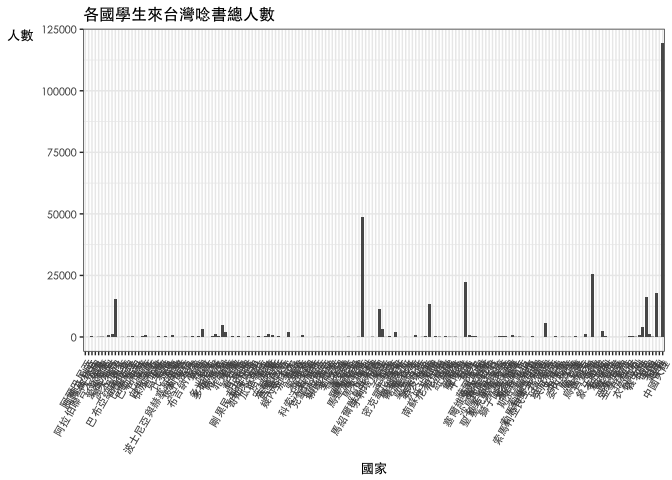

106-2 大數據分析方法 作業二
================
黃立玟

作業完整說明[連結](https://docs.google.com/document/d/1aLGSsGXhgOVgwzSg9JdaNz2qGPQJSoupDAQownkGf_I/edit?usp=sharing)

學習再也不限定在自己出生的國家，台灣每年有許多學生選擇就讀國外的大專院校，同時也有人多國外的學生來台灣就讀，透過分析[大專校院境外學生人數統計](https://data.gov.tw/dataset/6289)、[大專校院本國學生出國進修交流數](https://data.gov.tw/dataset/24730)、[世界各主要國家之我國留學生人數統計表](https://ws.moe.edu.tw/Download.ashx?u=C099358C81D4876CC7586B178A6BD6D5062C39FB76BDE7EC7685C1A3C0846BCDD2B4F4C2FE907C3E7E96F97D24487065577A728C59D4D9A4ECDFF432EA5A114C8B01E4AFECC637696DE4DAECA03BB417&n=4E402A02CE6F0B6C1B3C7E89FDA1FAD0B5DDFA6F3DA74E2DA06AE927F09433CFBC07A1910C169A1845D8EB78BD7D60D7414F74617F2A6B71DC86D17C9DA3781394EF5794EEA7363C&icon=..csv)可以了解103年以後各大專院校國際交流的情形。請同學分析以下議題，並以視覺化的方式呈現分析結果，呈現103年以後大專院校國際交流的情形。

來台境外生分析
--------------

### 資料匯入與處理

``` r
library(readr)
X104 <- read_csv("~/Downloads/104.csv")
```

    ## Parsed with column specification:
    ## cols(
    ##   洲別 = col_character(),
    ##   國別 = col_character(),
    ##   `學位生-正式修讀學位外國生` = col_integer(),
    ##   `學位生-僑生(含港澳)` = col_integer(),
    ##   `學位生-正式修讀學位陸生` = col_integer(),
    ##   `非學位生-外國交換生` = col_integer(),
    ##   `非學位生-外國短期研習及個人選讀` = col_integer(),
    ##   `非學位生-大專附設華語文中心學生` = col_integer(),
    ##   `非學位生-大陸研修生` = col_integer(),
    ##   `非學位生-海青班` = col_integer(),
    ##   境外專班 = col_integer()
    ## )

``` r
X104$各國人數加總104<-rowSums(X104[,3:11])
X104new<-X104[,c(T,T,F,F,F,F,F,F,F,F,F,T)]

library(readr)
X105 <- read_csv("~/Downloads/105.csv")
```

    ## Parsed with column specification:
    ## cols(
    ##   洲別 = col_character(),
    ##   國別 = col_character(),
    ##   學位生_正式修讀學位外國生 = col_integer(),
    ##   `學位生_僑生(含港澳)` = col_integer(),
    ##   學位生_正式修讀學位陸生 = col_integer(),
    ##   非學位生_外國交換生 = col_integer(),
    ##   非學位生_外國短期研習及個人選讀 = col_integer(),
    ##   非學位生_大專附設華語文中心學生 = col_integer(),
    ##   非學位生_大陸研修生 = col_integer(),
    ##   非學位生_海青班 = col_integer(),
    ##   境外專班 = col_integer()
    ## )

``` r
X105$各國人數加總105<-rowSums(X105[,3:11])
X105new<-X105[,c(T,T,F,F,F,F,F,F,F,F,F,T)]

library(readr)
X106<- read_csv("~/Downloads/106.csv")
```

    ## Parsed with column specification:
    ## cols(
    ##   洲別 = col_character(),
    ##   國別 = col_character(),
    ##   學位生_正式修讀學位外國生 = col_integer(),
    ##   `學位生_僑生(含港澳)` = col_integer(),
    ##   學位生_正式修讀學位陸生 = col_integer(),
    ##   非學位生_外國交換生 = col_integer(),
    ##   非學位生_外國短期研習及個人選讀 = col_integer(),
    ##   非學位生_大專附設華語文中心學生 = col_integer(),
    ##   非學位生_大陸研修生 = col_integer(),
    ##   非學位生_海青班 = col_integer(),
    ##   境外專班 = col_integer()
    ## )

``` r
X106$各國人數加總106<-rowSums(X106[,3:11])
X106new<-X106[,c(T,T,F,F,F,F,F,F,F,F,F,T)]

#依照校別
library(readr)
X104school <- read_csv("~/Downloads/104school.csv")
```

    ## Parsed with column specification:
    ## cols(
    ##   學校類型 = col_character(),
    ##   學校代碼 = col_character(),
    ##   學校名稱 = col_character(),
    ##   `學位生-正式修讀學位外國生` = col_integer(),
    ##   `學位生-僑生(含港澳)` = col_integer(),
    ##   `學位生-正式修讀學位陸生` = col_integer(),
    ##   `非學位生-外國交換生` = col_integer(),
    ##   `非學位生-外國短期研習及個人選讀` = col_integer(),
    ##   `非學位生-大專附設華語文中心學生` = col_integer(),
    ##   `非學位生-大陸研修生` = col_character(),
    ##   `非學位生-海青班` = col_integer(),
    ##   境外專班 = col_integer()
    ## )

``` r
X104school$`非學位生-大陸研修生`<-gsub("…","0",X104school$`非學位生-大陸研修生`)
X104school$`非學位生-大陸研修生`<-as.numeric(X104school$`非學位生-大陸研修生`)
X104school$境外學生人數加總104<-rowSums(X104school[,4:12])
X104schoolnew<-X104school[,c(T,T,T,F,F,F,F,F,F,F,F,F,T)]

library(readr)
X105school <- read_csv("~/Downloads/105school.csv")
```

    ## Parsed with column specification:
    ## cols(
    ##   學校類型 = col_character(),
    ##   學校代碼 = col_character(),
    ##   學校名稱 = col_character(),
    ##   學位生_正式修讀學位外國生 = col_integer(),
    ##   `學位生_僑生(含港澳)` = col_integer(),
    ##   學位生_正式修讀學位陸生 = col_integer(),
    ##   非學位生_外國交換生 = col_integer(),
    ##   非學位生_外國短期研習及個人選讀 = col_integer(),
    ##   非學位生_大專附設華語文中心學生 = col_integer(),
    ##   非學位生_大陸研修生 = col_integer(),
    ##   非學位生_海青班 = col_integer(),
    ##   境外專班 = col_integer()
    ## )

``` r
X105school$境外學生人數加總105<-rowSums(X105school[,4:12])
X105schoolnew<-X105school[,c(T,T,T,F,F,F,F,F,F,F,F,F,T)]

library(readr)
X106school <- read_csv("~/Downloads/106school.csv")
```

    ## Parsed with column specification:
    ## cols(
    ##   學校類型 = col_character(),
    ##   學校代碼 = col_character(),
    ##   學校名稱 = col_character(),
    ##   學位生_正式修讀學位外國生 = col_integer(),
    ##   `學位生_僑生(含港澳)` = col_integer(),
    ##   學位生_正式修讀學位陸生 = col_integer(),
    ##   非學位生_外國交換生 = col_integer(),
    ##   非學位生_外國短期研習及個人選讀 = col_integer(),
    ##   非學位生_大專附設華語文中心學生 = col_integer(),
    ##   非學位生_大陸研修生 = col_integer(),
    ##   非學位生_海青班 = col_integer(),
    ##   境外專班 = col_integer()
    ## )

``` r
X106school$境外學生人數加總106<-rowSums(X106school[,4:12])
X106schoolnew<-X106school[,c(T,T,T,F,F,F,F,F,F,F,F,F,T)]
```

### 哪些國家來台灣唸書的學生最多呢？

``` r
#這是R Code Chunk

library(dplyr)
```

    ## 
    ## Attaching package: 'dplyr'

    ## The following objects are masked from 'package:stats':
    ## 
    ##     filter, lag

    ## The following objects are masked from 'package:base':
    ## 
    ##     intersect, setdiff, setequal, union

``` r
J0405<-full_join(X104new,X105new,by=c("洲別","國別"))

library(dplyr)
J040506<-full_join(J0405,X106new,by=c("洲別","國別"))

J040506$各國人數加總104<-as.numeric(J040506$各國人數加總104)
J040506$各國人數加總105<-as.numeric(J040506$各國人數加總105)
J040506$各國人數加總106<-as.numeric(J040506$各國人數加總106)

J040506$三年度加總<-rowSums(J040506[,3:5],na.rm=TRUE)

J040506<-J040506[order(J040506$三年度加總,decreasing = T),]
J040506fin<-J040506[1:10,]
knitr::kable(J040506fin)
```

| 洲別 | 國別     | 各國人數加總104 | 各國人數加總105 | 各國人數加總106 | 三年度加總 |
|:-----|:---------|:---------------:|:---------------:|:---------------:|:----------:|
| 亞洲 | 中國大陸 |      41951      |      41981      |      35304      |   119236   |
| 亞洲 | 馬來西亞 |      15054      |      16311      |      17281      |    48646   |
| 亞洲 | 香港     |       8233      |       8660      |       8761      |    25654   |
| 亞洲 | 日本     |       6455      |       7542      |       8387      |    22384   |
| 亞洲 | 越南     |       4459      |       5342      |       7864      |    17665   |
| 亞洲 | 印尼     |       4454      |       5154      |       6453      |    16061   |
| 亞洲 | 澳門     |       5152      |       5286      |       5141      |    15579   |
| 亞洲 | 南韓     |       4062      |       4575      |       4724      |    13361   |
| 美洲 | 美國     |       4003      |       3701      |       3814      |    11518   |
| 亞洲 | 泰國     |       1591      |       1771      |       2138      |    5500    |

### 哪間大學的境外生最多呢？

``` r
#這是R Code Chunk

library(dplyr)
JS0405<-full_join(X104schoolnew,X105schoolnew,by=c("學校類型","學校代碼","學校名稱"))

library(dplyr)
JS040506<-full_join(JS0405,X106schoolnew,by=c("學校類型","學校代碼","學校名稱"))

JS040506$三年度加總<-rowSums(JS040506[,4:6],na.rm=TRUE)

JS040506<-JS040506[order(JS040506$三年度加總,decreasing = T),]
JS040506fin<-JS040506[2:11,]
knitr::kable(JS040506fin)
```

| 學校類型 | 學校代碼 | 學校名稱         | 境外學生人數加總104 | 境外學生人數加總105 | 境外學生人數加總106 | 三年度加總 |
|:---------|:---------|:-----------------|:-------------------:|:-------------------:|:-------------------:|:----------:|
| 大專校院 | 0004     | 國立臺灣師範大學 |         5328        |         5709        |         6428        |    17465   |
| 大專校院 | 0003     | 國立臺灣大學     |         4514        |         4817        |         5068        |    14399   |
| 大專校院 | 1016     | 銘傳大學         |         4152        |         4159        |         4294        |    12605   |
| 大專校院 | 1006     | 中國文化大學     |         4188        |         4046        |         3703        |    11937   |
| 大專校院 | 1005     | 淡江大學         |         3254        |         3727        |         3920        |    10901   |
| 大專校院 | 0001     | 國立政治大學     |         2871        |         2989        |         3061        |    8921    |
| 大專校院 | 0005     | 國立成功大學     |         2554        |         2864        |         3179        |    8597    |
| 大專校院 | 1007     | 逢甲大學         |         2479        |         2440        |         2523        |    7442    |
| 大專校院 | 1002     | 輔仁大學         |         2271        |         2518        |         2434        |    7223    |
| 大專校院 | 1004     | 中原大學         |         1703        |         1995        |         2611        |    6309    |

### 各個國家來台灣唸書的學生人數條狀圖

``` r
#這是R Code Chunk
library(ggplot2)
ggplot(data = J040506)+
  geom_bar(aes(x=J040506$國別,y=J040506$三年度加總),
           stat = "identity")+
  labs(title="各個國家(全部)來台灣唸書的學生人數",
       x="Country",
       y="Number") +
  theme_bw()
```



### 各個國家來台灣唸書的學生人數面量圖

``` r
#這是R Code Chunk
```

台灣學生國際交流分析
--------------------

### 資料匯入與處理

``` r
#這是R Code Chunk
library(readxl)
Student<- read_excel("~/Desktop/複製 - Student_RPT_07.xlsx")
```

### 台灣大專院校的學生最喜歡去哪些國家進修交流呢？

``` r
#這是R Code Chunk
library(dplyr)
Studentout<-group_by(Student,`對方學校(機構)國別(地區)`)%>%
  summarise(各國總人數=sum(小計))
Studentout1<-head(Studentout[order(Studentout$各國總人數,decreasing = T),],10)
```

### 哪間大學的出國交流學生數最多呢？

``` r
#這是R Code Chunk
```

### 台灣大專院校的學生最喜歡去哪些國家進修交流條狀圖

``` r
#這是R Code Chunk
```

### 台灣大專院校的學生最喜歡去哪些國家進修交流面量圖

``` r
#這是R Code Chunk
```

台灣學生出國留學分析
--------------------

### 資料匯入與處理

``` r
#這是R Code Chunk
```

### 台灣學生最喜歡去哪些國家留學呢？

``` r
#這是R Code Chunk
```

### 台灣學生最喜歡去哪些國家留學面量圖

``` r
#這是R Code Chunk
```

綜合分析
--------

請問來台讀書與離台讀書的來源國與留學國趨勢是否相同(5分)？想來台灣唸書的境外生，他們的母國也有很多台籍生嗎？請圖文並茂說明你的觀察(10分)。
